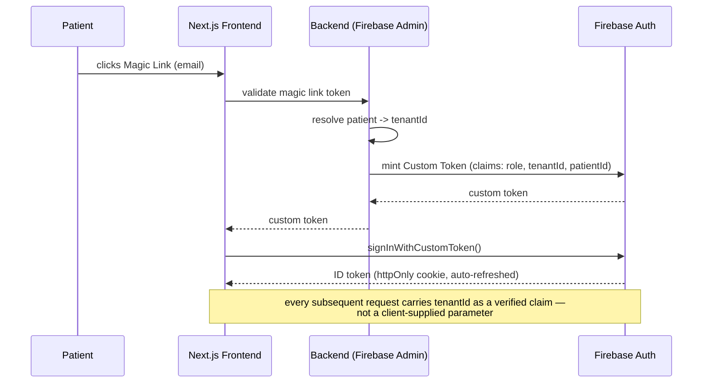

# Zymsia Pro — Multi-Tenant SaaS for Nutrition Professionals

A deployed Next.js platform that gives nutrition professionals their own branded practice — patient management, AI-assisted coaching, and a patient-facing portal — running on shared infrastructure with hard tenant isolation.

This repo is a sanitized case-study extract: architecture, decisions, and UI, not the production source.

**Role:** Product & Delivery Lead: product definition, architecture decisions, delivery governance and QA, with Claude Code as the execution team ([PM-led, AI-executed delivery](https://github.com/eugeniozamora/pm-led-delivery)).

## The problem

Nutrition professionals need software, but not each their own server. The platform had to serve many independent practices (tenants) from one codebase and one database, while guaranteeing that a coach at Tenant A can never see, query, or leak into Tenant B's patients — and that patients themselves get a lightweight, no-signup-friction way to talk to their coach.

That's a B2B2C shape: the professional is the paying customer (B2B), their patients are the end users (B2C) — and both need to trust the same system for different reasons.

## Architecture — tenant-scoped auth

**Key decision — tenant identity lives in the auth token, not the request body.** Early designs passed `tenantId` as a request parameter, which meant every endpoint had to remember to validate it. Moving `tenantId` and `role` into Firebase custom claims means the token itself is the source of truth — an endpoint that forgets to check it simply can't see cross-tenant data, because the data layer filters by the verified claim, not by trusting the caller.

**Magic links over passwords for patients.** Patients are not the ones paying for or configuring the software — they're being invited into it. A password-reset flow is friction and a support burden; a magic link with a long-lived, auto-refreshing session cookie removes both.

## Tech stack

| Layer | Choice | Why |
|---|---|---|
| Frontend | Next.js 14 (TypeScript), Vercel | preview deployments per PR, fast edge rendering |
| Auth | Firebase Auth, custom tokens + claims | tenant/role scoping enforced at the token level |
| Data | Firebase / Firestore | tenant-partitioned collections, security rules as a second enforcement layer |
| Observability | Sentry (client + server + edge) | catch tenant-isolation regressions in production, not just in review |
| CI/CD | Vercel preview deploys, `develop` → `main` flow | reviewable before every prod release |

## Product surface

- Coach-facing dashboard: patient roster, plan builder, AI-assisted coaching suggestions
- Patient-facing portal: no-signup magic-link access, progress tracking
- Multi-environment setup: isolated dev and prod Firebase projects, not just config flags

## What's in this repo vs. what's not

This extract includes the auth architecture, the tenant-isolation reasoning, and representative UI screenshots. It omits the production source tree, tenant and patient data, pricing and go-to-market docs, and infrastructure credentials — those stay in the private repo.

Happy to walk through the architecture in more depth on a technical call.

**[Book a meeting](https://calendar.app.google/5FeUeC4X1VBYt2bU6)** · [eugeniozamora.com](https://eugeniozamora.com) · [LinkedIn](https://www.linkedin.com/in/eugeniozamora/) · [GitHub](https://github.com/eugeniozamora)
